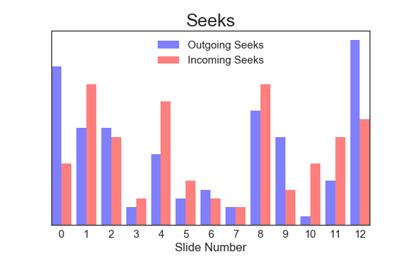

# MOOC Analytics and Vizualisation

This project took place under the supervision of Prof. Patrick Jermann and Dr. Francisco Pinto.

The goal was to leverage MOOC Data in order to create a tool for teacher, giving them a feedback about the behaviour of the students while watching their classes. It is split in two different parts, the first one focused on the analysis of the logs, and the second one on the visualisation (the tool for teachers).

## Analysis
Note : All the analysis will be done on a specific video : BIO-465 : Biological modeling of neural networks, Week 7, part 4.

### First Selection

The analysis is separated in multiple parts. The first one is the selection of the relevant Data. The logs we used are the complete ones, meaning that all the events were recorded. The following table lists those events. We first selection we made was based both on intuition and basic analysis.


| EventType | Analyzed | Final Version | Comments | Nbr |
|-------------------|----------|---------------|-----------------------------------------------------------------------------|-----|
| Video.Pause | Yes | No | When a user pauses the video at a certain time | 370 |
| Video.Play | Yes | No | When a user plays the video, either at the beginning or after a pause. | 562 |
| Video.SpeedChange | No | No | When a user changes the speed of the video. | 2 |
| Video.Seek | Yes | Yes | When a user jump to a specific time of the video, from any other time. | 347 |
| Video.Load | No | No | When the video is loaded. | 513 |
| Video.Transcript | No | No | When the user changes the subtitles display (on/off or different language). | 859 |
| Video.Stop | No | No | When the user closes the video. | 61 |

 
* The SpeedChanges did not have enough Data
* The Load could not give us any information, as it always appears before any other event (same reasoning for the Stop)
* The Transcript was only set once by the other, therefore not interesting either.

Thus we went with the Seeks, and the Pauses & Plays which we grouped into a single event.

### Cleaning

The second step was to clean our Data.

* For the Seek event, the user has a tendency to give a few tries before arriving at the precise moment of the video he wants. Therefore, we have between 2 and 10 Seek events in a close period of time (usually a few seconds) for the same user. To resolve this issue, we've decided to keep only the initial time of the first event, and the final time of the final one (we've deleted all the intermediate hops).
* For the Pauses & Plays, the problem was the numerous amount of breaks with a duration of only a few seconds. In the same reasoning as above, those small breaks are not interesting for our analysis. We want to identify the problematic parts of a video, meaning the parts where a high number of students have stopped the video, or jumped to this part. In our opinion, those small breaks are more linked to the behaviour of the student (loss of attention, ...) than to the real complexity of the slide. Therefore we've decided to keep only the breaks with a duration bigger than ten seconds. In the same reasoning, a break longer than an hour is not relevant either.

### Analysis

The idea behind this project is to identify the "problematic" parts of a video. To do so, we need a metric for the different parts, but more importantly we need a delimitation for the parts, in order to work with discrete values. As the videos are mostly presentations, they have a natural structure composed of slides. To extract those slides, we tried simple image processing algorithms, but the results were not reliable at 100%, and we lacked of time to develop a reliable tool. For this example, we extracted the timestamps of slide changes by hand.

We tried different normalizations, as the slides do not have a linear time distribution. In the end, we simply dropped the time parameter. Our reasoning was based on the fact that the user will stop / jump during the slide if the content is hard to understand, no matter the duration of the slide.

We can now visualise the Data of the Seeks and the Pauses&Plays, grouped by slide.

#### Seeks

Each Seek event has a source, and a target. As our visualisation is based on a flow chart, this structure is exactly what we need. The graph below represents the number of seeks with each slide as source, and as target. Even if both the incoming and outgoing logs are interesting, the number of incoming users represents the number of people that went back or forward to this slide in particular, meaning that they needed its content. From our point of view, this is therefore more important than the number of people that left this slide to go to another one.

#### Pauses & Plays

The pauses & plays have the same slide as source and target. Therefore this Data does not fit into our visualisation. We could add a metric / weight to each node, but only if the Data adds a real value to our analysis. First, we compare the total of number of pauses with the number of different users (unique pausers). As depicted on the graph below, the total number of pauses does not exceed 120-130% of unique pausers number. The Data is thus not biaised and we concentrate on the total pauses number.




#### Comparison

In order to determine the added value of the number of Pauses, we normalized both Data sets, and we compare them. The graph below shows clearly that the Data sets are correlated, except for a few slides. A further analysis showed that those slides were generally short, therefore not very representative of the other slides.

<p align='center'>

</p>

Thus we've decided to use exclusively the Seek events.

## Visualisation

For the visualisation, the goal is to create a tool straightforward, understandable and easy to use. The picture belows shows the expanded version of it.

<p align='center'>

</p>

The tool is separated in two main parts. The first one, the top panel, contains parts (1), (2) and (3). The second one, the flow chart, contains parts (4),(5) and (6).

### Elements of the tool


1. The top left panel is the video browser. The description of each video is simplified as much as possible. We also put the code of the Course as a title. The teacher will know which course it is, as they do not have that much different courses to teach. When the teacher clicks on one video, the entire tool is refreshed, displaying the Data of the new video.


2. The top right panel only contains two sliders. The first one controls the expansion of the flowchart. The second one is called "Auto-play", it controls the content of element (3), which is the displays of the video itself or a snapshot of it in the middle. It simply allows the user to switch between the view of a snapshot of currently selected / highlighted slide, and the video itself. 


3. The top center panel, as explained above, displays either the video, or a simple snapshot of a slide. The progress bar below the image shows those two things. the highlighted part represents the time location of the slide, inside the video. At each extremity, there is a time. The left one represents the elapsed time, while the right one represents the remaining time. 

4. The snapshots bar has a single purpose. When no slide is selected, all the snapshots are visible. If the user only mouse-overs a node, only the corresponding slide will stay visible, all the other ones will be greyed. The corresponding content will also be displayed in the top frame, either as a snapshot or the video depending on the state of the Auto-play slider.

5. The links are the core of the flowchart. For each slide, we have the number of users going to every slide from this one, and coming from every slide to this one. Therefore, each slide acts both as source and as target. We’ve represented each slide as a node, presents twice (as source and target). Those links have a thickness representing the number of users who travelled from a specific slide to another one. This number is also written in a small square box.

6. The rectangles (nodes) represent the slides. The flowchart goes downward, thus the top row represents the sources while the bottom one represents the targets. For each class (source/target), the slide with the highest number of incoming/outgoing links is displayed with the maximum opacity (in our example, source 12 and target 8). All the other slides have an opacity linearly decreasing with their importance.


## How to use it

### Analysis part

To run the analysis of the Data, use the Notebook `scripts/Video_analysis.ipynb`. 

Enter manually the details of the video, as well as the timestamps of slide changes.

```python
course_code = "bio-465"
week_number = "7"
part_number = "4"

slides_timestamp = '00:00:18,268 00:01:20,138 ...'
```

Put the csv file in the correct place, then run the entire notebook. It will create a JSON file in `visualisation/data/json/<video_id>.json` and display some visualisations to give an insight about the Data of the video.

If you use a Python server :

* Launch `python3 -m http.server`
* Open `http://localhost:8000/<path_to_repo>/visualisation/index.html` in your favorite browser
* Play with the tool


